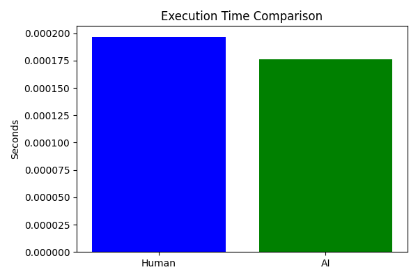

# 🧠 AI Code Evaluation Project

This project compares a human-written and an AI-generated solution to the classic problem of reversing a singly linked list. The comparison includes:

- Execution time
- Code length (number of lines)
- Output correctness
- Visual benchmarking with charts

## 📂 Project Structure

ai-code-eval-project/ 
    ├── data/ 
        │ ├── code_length.png # Line count comparison (human vs AI)
        │ └── execution_time.png # Execution time benchmark 
    ├── Solutions/ │ 
        ├── ai_solution_1.py # AI-generated linked list reversal │
        ├── human_solution_1.py # Human-written linked list reversal 
        │ └── compare_solutions.py # Script to benchmark both solutions 
    ├── Tests/ 
        │ └── test_solutions.py # Unit tests for both implementations 
├── README.md

## ⚙️ Problem

Given the head of a singly linked list, reverse the list, and return the reversed list.

Both the human and AI solutions solve the same problem using different approaches.

## 📊 Metrics

- ✅ Outputs Match: `True`
- ⏱️ Execution Time: Measured using `time.perf_counter()`
- 📏 Code Length: Measured in raw `.py` file line counts

## 🧪 Test Cases

Unit tests located in `Tests/test_solutions.py` confirm correctness for both implementations.

## 📈 Benchmarking Results

### ⏱️ Execution Time

Lower is better.

### 📏 Code Length

Shorter is not always better, but it reflects conciseness.

## 🛠 Technologies

- Python 3.8+
- Matplotlib
- unittest

## 🚀 How to Run

1. Clone the repo  
2. Install matplotlib: `pip install matplotlib`
3. Run the benchmark:  

## 🤖 Purpose

This project simulates real-world evaluation of AI-generated code in a measurable, testable way. It demonstrates not just whether the AI is correct—but how efficient and clean its solution is compared to a human’s.

---

Made with 🧠 + 🧑‍💻
